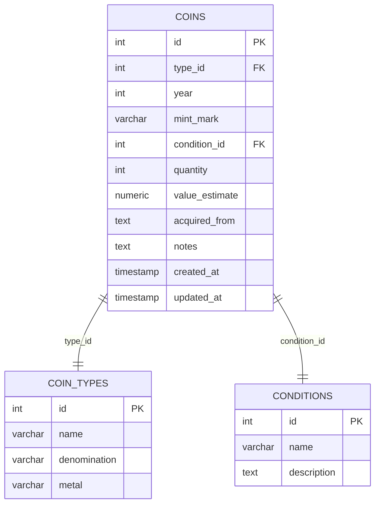

```mermaid
erDiagram
    COINS {
        int id PK
        int type_id FK
        int year
        varchar mint_mark
        int condition_id FK
        int quantity
        numeric value_estimate
        text acquired_from
        text notes
        timestamp created_at
        timestamp updated_at
    }
    
    COIN_TYPES {
        int id PK
        varchar name
        varchar denomination
        varchar metal
    }
    
    CONDITIONS {
        int id PK
        varchar name
        text description
    }
    
    COINS ||--|| COIN_TYPES : "type_id"
    COINS ||--|| CONDITIONS : "condition_id"
```
