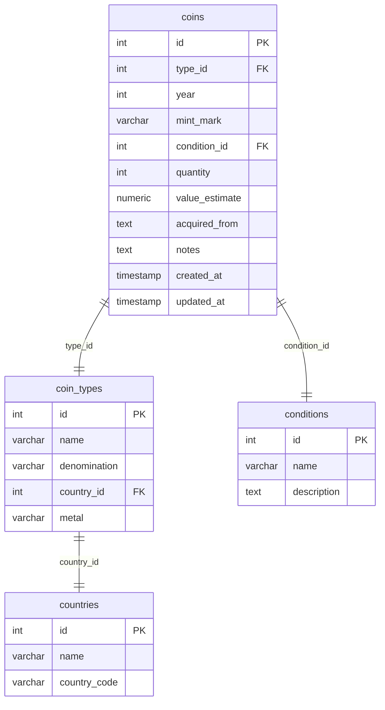

```mermaid
erDiagram
    coins {
        int id PK
        int type_id FK
        int year
        varchar mint_mark
        int condition_id FK
        int quantity
        numeric value_estimate
        text acquired_from
        text notes
        timestamp created_at
        timestamp updated_at
    }

    coin_types {
        int id PK
        varchar name
        varchar denomination
        int country_id FK
        varchar metal
    }

    conditions {
        int id PK
        varchar name
        text description
    }

    countries {
        int id PK
        varchar name
        varchar country_code
    }

    coins ||--|| coin_types : "type_id"
    coins ||--|| conditions : "condition_id"
    coin_types ||--|| countries : "country_id"
```
